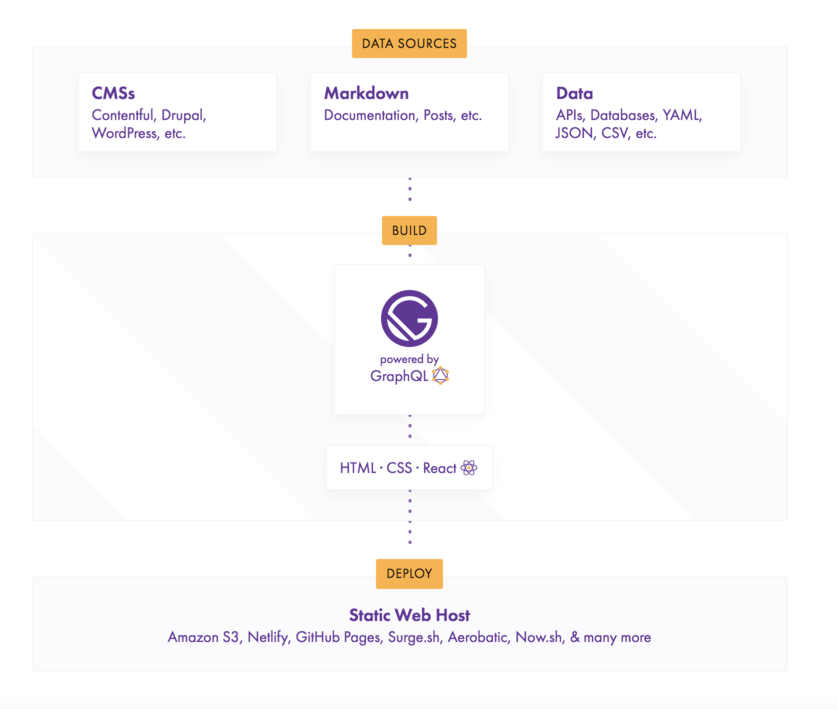
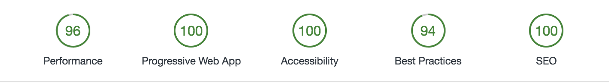

# GatsbyJS

Blazing fast static sites with React and GraphQL!

---

# What is GatsbyJS?!!!!!!!!!!!!!!

> Gatsby is a free and open source framework based on React that helps developers build blazing fast websites and apps
> <cite>Gatsby Docs</cite>

---

---

# Why Choose Gatsby?

* PWA(Progressive Web Apps)
* All the benefits of React
* 100% SEO out of the box
* Plugins and starter ecosystem is vast
* Headless CMS

---

---

# Why is Gatsby so Fast?

* Gatsby is on average 3 times faster than similar types of sites
* There is no option when it comes to performance, it's baked in
* Performance is auto optimized for YOUR site via code splitting etc
* Think of Gatsby as a website compiler
